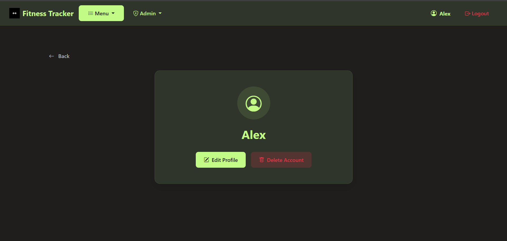

# WebFitnessTrackerApp


### Завдання 3 варіант 2(Веб застосунок)

1) Створені базові моделі User,Goal,Workout,UserRole(для security) з використанням Lombok. 
2) Створені Request та Response DTOs для передачі данних.
3) Створені JpaRepositories с декількома кастомними методами для витагання данних з БД
4) Створені мапери для перетворення Response та Request в Entity а навпаки
5) Створені сервіси з CRUD методами, та методами для витагання та змыни додаткових данних.
6) Створений кастомний ексепшн, та GlobalExceptionHandler
7) Налаштований SecurityConfig та кодуванн паролю
8) Створені контроллери для налаштування ендпоінтів та передачі данних з бекенду на фронтенд. Також були створені окремі контроллери для адмінів
9) Був налаштований докер з базою данних
10) Створені HTML сторінки з використанням Thymeleaf, та CSS
11) Написані юніт тести для сервісів та контроллерів

### Функціонал:
1) Логін та реєстрація користувачів.
2) Перегляд профілю користувача, зміна юзернейму, та видалення користувача.
3) Додавання, видалення, редагування та видалення тренувань та цілей, також можливість перегляду кожної окремо та списку усіх
4) Можливість позначити кнопкою ціль як виконану
5) Повідомлення про помилки на формах створення, редагування
6) Окремі сторінки для адмінів з можливістю перегляду усіх юзерів, тренувань, та цілей з можливістю видалення, редагування та перегляду.

### Інсталяція

1) Клонуйте репозиторій
```bash
git clone https://github.com/Phent1s/WebFitnessTracker.git
```
2) Перейдіть у директорію проєкту
```bash
cd WebFitnessTracker
```
3) Виконайте Docker Compose
```bash
docker compose up
```


# Скріни застосунку

## Домашня сторінка(не авторизована), адмін, звичайний юзер


## Сторінка логіну, реєстрації


## Профіль


## Повідомлення перед видаленням


## Редагування профілю(Поле ролі приховано для звичайних юзерів)


## Список тренуваннь


## Створення тренувань


## Редагування тренувань


## Перегляд тренування


## Список цілей


## Створення цілей


## Редагування цілей


## Перегляд цілі


## Адмін сторінки


